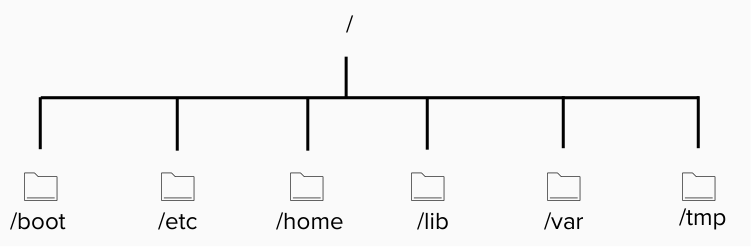

## /
En la jerarquía de directorios / es la raíz a partir de la cual se derivan el resto de directorios, por ello cada directorio lleva un / en el nombre

Diagrama de jerarquía de sistema de archivos

